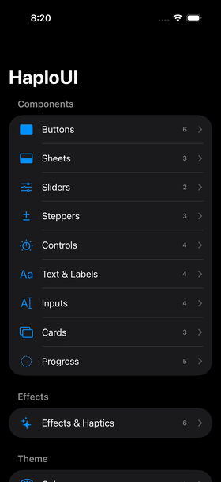

# HaploUI

<p align="center">
  
</p>

A beautiful, consistent SwiftUI component library for all Haplo apps. Features animated controls, glass effects, haptic feedback, and a built-in component catalog.

## Installation

### Swift Package Manager

```swift
dependencies: [
    .package(url: "https://github.com/haplollc/HaploUI.git", from: "1.0.0")
]
```

Or in Xcode: **File → Add Package Dependencies → `https://github.com/haplollc/HaploUI`**

## Component Catalog

Browse all components with the built-in catalog:

```swift
import HaploUI

@main
struct MyApp: App {
    var body: some Scene {
        WindowGroup {
            ComponentCatalog()
        }
    }
}
```

---

## Components

<table>
<tr>
<td width="300" align="center">
<br>
<b>Buttons</b>
</td>
<td>

```swift
// Styles: .primary, .secondary, .tertiary, 
//         .destructive, .ghost, .outline
HaploButton("Save", style: .primary) { }
HaploButton("Delete", icon: "trash", style: .destructive) { }

// Sizes: .small, .medium, .large
HaploButton("Submit", size: .large, isFullWidth: true) { }

// Icon buttons
HaploIconButton(icon: "heart.fill") { }
```

</td>
</tr>
<tr>
<td align="center">
<br>
<b>Sheets</b>
</td>
<td>

```swift
// Standard sheet
HaploSheet(title: "Settings", subtitle: "Configure") {
    // content
}

// Action sheet
HaploActionSheet(actions: [
    .init(title: "Edit", icon: "pencil") { },
    .init(title: "Delete", style: .destructive) { }
])

// Confirmation
HaploConfirmationSheet(
    title: "Delete?",
    message: "Cannot be undone",
    onConfirm: { }, onCancel: { }
)
```

</td>
</tr>
<tr>
<td align="center">
<br>
<b>Inputs</b>
</td>
<td>

```swift
// Text field with icon & validation
HaploTextField(
    text: $email,
    placeholder: "Email",
    icon: "envelope",
    errorMessage: error
)

// Text area
HaploTextArea(text: $notes, placeholder: "Notes...")

// Search
HaploSearchField(text: $query)

// Toggle with subtitle
HaploToggle(isOn: $enabled, label: "Notifications", 
            subtitle: "Get alerts", icon: "bell")
```

</td>
</tr>
<tr>
<td align="center">
<br>
<b>Sliders</b>
</td>
<td>

```swift
// Standard slider
HaploSlider(value: $volume, in: 0...100, label: "Volume")

// With step & formatter
HaploSlider(value: $brightness, in: 0...100, step: 5,
            valueFormatter: { "\(Int($0))%" })

// Range slider
HaploRangeSlider(
    lowerValue: $min, upperValue: $max,
    in: 0...1000, label: "Price Range"
)
```

</td>
</tr>
<tr>
<td align="center">
<br>
<b>Steppers</b>
</td>
<td>

```swift
// Standard stepper
HaploStepper(value: $qty, in: 0...99, label: "Quantity")

// Compact +/- buttons
HaploCompactStepper(value: $sets, in: 1...20)

// Wheel picker style
HaploWheelStepper(value: $mins, in: 1...60)
```

</td>
</tr>
<tr>
<td align="center">
<br>
<b>Controls</b>
</td>
<td>

```swift
// Animated segmented control
HaploSegmentedControl(
    options: ["Day", "Week", "Month"],
    selection: $period
)

// Duration picker (h:m:s)
HaploDurationPicker(totalSeconds: $duration)

// Time picker
HaploTimePicker(hour: $h, minute: $m)
```

</td>
</tr>
<tr>
<td align="center">
<br>
<b>Text & Labels</b>
</td>
<td>

```swift
// Styled text
HaploText("Title", style: .title)
HaploText("Body", style: .body, color: .secondary)

// Label with icon
HaploLabel("Settings", icon: "gear")

// Badge
HaploBadge("New", color: .green)

// Selectable chip
HaploChip("Running", isSelected: true) { }
```

</td>
</tr>
<tr>
<td align="center">
<br>
<b>Cards</b>
</td>
<td>

```swift
// Basic card
HaploCard { Text("Content") }

// Info card with navigation
HaploInfoCard(
    title: "Settings",
    subtitle: "Configure",
    icon: "gear"
) { }

// Stats card with trend
HaploStatCard(
    title: "Workouts", value: "24",
    trend: .up("+12%")
)
```

</td>
</tr>
<tr>
<td align="center">
<br>
<b>Progress</b>
</td>
<td>

```swift
// Radial progress
HaploRadialProgress(progress: 0.65, size: 80)
HaploRadialProgress(progress: 0.7, currentStep: 7, 
                    totalSteps: 10)

// Linear progress
HaploLinearProgress(progress: 0.5, showLabel: true)

// Indeterminate
HaploIndeterminateProgress()

// Loading indicators
HaploPulsingIndicator()
HaploDotsLoading()
```

</td>
</tr>
<tr>
<td align="center">
<br>
<b>Effects</b>
</td>
<td>

```swift
// Glass effects (iOS 26+ with fallback)
Text("Glass").glassCapsule()
Icon().glassCircle(tint: .blue)
VStack { }.glassCard()

// Shimmer loading
Text("Loading").shimmer()
HaploSkeleton(width: 200, height: 20)

// Haptic feedback
Button("Tap") { }.haptic(.medium)
Button("Done") { }.hapticNotification(.success)
```

</td>
</tr>
</table>

---

## Theme

Access consistent design tokens:

```swift
// Colors
HaploTheme.Colors.primary       // Blue
HaploTheme.Colors.secondary     // Purple
HaploTheme.Colors.success       // Green
HaploTheme.Colors.warning       // Yellow
HaploTheme.Colors.error         // Red

// Spacing (in points)
HaploTheme.Spacing.xs   // 4
HaploTheme.Spacing.sm   // 8
HaploTheme.Spacing.md   // 12
HaploTheme.Spacing.lg   // 16
HaploTheme.Spacing.xl   // 24

// Corner Radius
HaploTheme.CornerRadius.sm   // 6
HaploTheme.CornerRadius.md   // 10
HaploTheme.CornerRadius.lg   // 16

// Typography
HaploTheme.Typography.largeTitle
HaploTheme.Typography.headline
HaploTheme.Typography.body
HaploTheme.Typography.caption

// Animation
HaploTheme.Animation.spring
HaploTheme.Animation.bouncy

// Shadows
view.haploShadow(HaploTheme.Shadows.md)
```

---

## Requirements

- iOS 17.0+ / macOS 14.0+
- Swift 5.9+

## License

MIT
