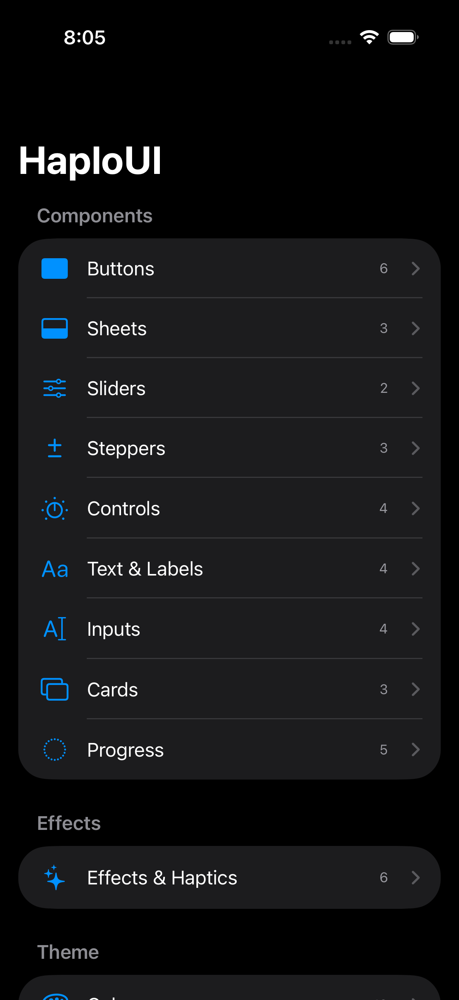

# HaploUI

<p align="center">
  
</p>

A beautiful, consistent SwiftUI component library for all Haplo apps. Features animated controls, glass effects, haptic feedback, and a built-in component catalog for browsing everything.

## Installation

### Swift Package Manager

Add to your `Package.swift`:

```swift
dependencies: [
    .package(url: "https://github.com/haplollc/HaploUI.git", from: "1.0.0")
]
```

Or in Xcode: **File → Add Package Dependencies → `https://github.com/haplollc/HaploUI`**

## Quick Start

```swift
import SwiftUI
import HaploUI

struct ContentView: View {
    @State private var email = ""
    @State private var isLoading = false
    
    var body: some View {
        VStack(spacing: 16) {
            HaploTextField(
                text: $email,
                placeholder: "Email",
                icon: "envelope"
            )
            
            HaploButton("Sign In", icon: "arrow.right", isLoading: isLoading) {
                isLoading = true
            }
            .haptic(.medium)
        }
        .padding()
    }
}
```

## Component Catalog

Browse all components with the built-in catalog:

```swift
import HaploUI

@main
struct MyApp: App {
    var body: some Scene {
        WindowGroup {
            ComponentCatalog()
        }
    }
}
```

---

## Components

### Buttons

#### HaploButton
Standard button with multiple styles, sizes, icons, and loading state.

```swift
// Basic
HaploButton("Save") { }

// With icon
HaploButton("Download", icon: "arrow.down.circle") { }

// Styles: .primary, .secondary, .tertiary, .destructive, .ghost, .outline
HaploButton("Delete", style: .destructive) { }

// Sizes: .small, .medium, .large
HaploButton("Small", size: .small) { }

// Full width with loading
HaploButton("Submit", isFullWidth: true, isLoading: isLoading) { }
```

#### HaploIconButton
Circular icon button.

```swift
HaploIconButton(icon: "heart.fill", style: .primary) { }
HaploIconButton(icon: "ellipsis", size: .large) { }
```

---

### Sheets

#### HaploSheet
Standard sheet container with title, subtitle, and drag indicator.

```swift
.sheet(isPresented: $showSheet) {
    HaploSheet(title: "Settings", subtitle: "Configure your preferences") {
        // Content
    }
}
```

#### HaploActionSheet
Action menu with icons and destructive options.

```swift
HaploActionSheet(
    title: "Actions",
    actions: [
        .init(title: "Share", icon: "square.and.arrow.up") { },
        .init(title: "Edit", icon: "pencil") { },
        .init(title: "Delete", icon: "trash", style: .destructive) { }
    ]
)
```

#### HaploConfirmationSheet
Confirmation dialog with cancel/confirm buttons.

```swift
HaploConfirmationSheet(
    title: "Delete Item?",
    message: "This action cannot be undone.",
    confirmTitle: "Delete",
    confirmStyle: .destructive,
    onConfirm: { },
    onCancel: { }
)
```

---

### Inputs

#### HaploTextField
Text field with label, icon, and error state.

```swift
HaploTextField(
    text: $email,
    placeholder: "you@example.com",
    label: "Email",
    icon: "envelope",
    errorMessage: emailError
)

// Secure field
HaploTextField(text: $password, placeholder: "Password", isSecure: true)
```

#### HaploTextArea
Multi-line text input.

```swift
HaploTextArea(
    text: $notes,
    placeholder: "Write your notes...",
    label: "Notes",
    minHeight: 100,
    maxHeight: 200
)
```

#### HaploSearchField
Search bar with clear button.

```swift
HaploSearchField(text: $searchText, placeholder: "Search workouts")
```

#### HaploToggle
Toggle with label, subtitle, and icon.

```swift
HaploToggle(
    isOn: $enableNotifications,
    label: "Notifications",
    subtitle: "Receive push notifications",
    icon: "bell.fill"
)
```

---

### Sliders

#### HaploSlider
Slider with label, value display, and custom formatting.

```swift
HaploSlider(
    value: $volume,
    in: 0...100,
    step: 5,
    label: "Volume",
    valueFormatter: { "\(Int($0))%" }
)
```

#### HaploRangeSlider
Dual-thumb range slider.

```swift
HaploRangeSlider(
    lowerValue: $minPrice,
    upperValue: $maxPrice,
    in: 0...1000,
    label: "Price Range",
    valueFormatter: { "$\(Int($0)) - $\(Int($1))" }
)
```

---

### Steppers

#### HaploStepper
Standard stepper with label and custom formatting.

```swift
HaploStepper(
    value: $quantity,
    in: 0...99,
    step: 1,
    label: "Quantity"
)
```

#### HaploCompactStepper
Compact plus/minus buttons.

```swift
HaploCompactStepper(value: $sets, in: 1...20)
```

#### HaploWheelStepper
Wheel picker style stepper.

```swift
HaploWheelStepper(value: $timer, in: 1...60, label: "Minutes")
```

---

### Controls

#### HaploSegmentedControl
Animated pill-style segmented control.

```swift
HaploSegmentedControl(
    options: ["Day", "Week", "Month"],
    selection: $selectedPeriod
)
```

#### HaploDurationPicker
Hours, minutes, seconds picker.

```swift
HaploDurationPicker(
    totalSeconds: $duration,
    showHours: true,
    showSeconds: true
)
```

#### HaploTimePicker
Simple time picker.

```swift
HaploTimePicker(hour: $hour, minute: $minute, is24Hour: false)
```

---

### Text & Labels

#### HaploText
Styled text with predefined styles.

```swift
HaploText("Title", style: .title)
HaploText("Secondary", style: .body, color: .secondary)
```

#### HaploLabel
Label with icon.

```swift
HaploLabel("Settings", icon: "gear", iconColor: .blue)
```

#### HaploBadge
Colored badge.

```swift
HaploBadge("New", color: .green, size: .small)
HaploBadge("Featured", size: .large)
```

#### HaploChip
Selectable chip/tag.

```swift
HaploChip("Running", icon: "figure.run", isSelected: isSelected) {
    isSelected.toggle()
}
```

---

### Cards

#### HaploCard
Generic card container.

```swift
HaploCard(padding: 16, cornerRadius: 12, hasShadow: true) {
    Text("Card content")
}
```

#### HaploInfoCard
Info row with icon and chevron.

```swift
HaploInfoCard(
    title: "Settings",
    subtitle: "Configure preferences",
    icon: "gear",
    iconColor: .blue
) {
    // Navigate to settings
}
```

#### HaploStatCard
Statistics card with trend indicator.

```swift
HaploStatCard(
    title: "Workouts",
    value: "24",
    subtitle: "This week",
    icon: "flame.fill",
    trend: .up("+12%"),
    accentColor: .orange
)
```

---

### Progress

#### HaploRadialProgress
Circular progress indicator.

```swift
// Percentage
HaploRadialProgress(progress: 0.65, size: 80)

// With steps
HaploRadialProgress(
    progress: 0.7,
    currentStep: 7,
    totalSteps: 10,
    accentColor: .green
)
```

#### HaploLinearProgress
Horizontal progress bar.

```swift
HaploLinearProgress(progress: 0.5, showLabel: true)
```

#### HaploIndeterminateProgress
Animated loading bar.

```swift
HaploIndeterminateProgress(height: 4, accentColor: .blue)
```

#### Loading Indicators

```swift
HaploPulsingIndicator(size: 12, color: .blue)
HaploDotsLoading(size: 8, color: .gray)
```

---

## Effects

### Glass Effects
iOS 26+ glass effects with fallback for older versions.

```swift
Text("Glass")
    .padding()
    .glassCapsule()
    
Image(systemName: "star")
    .frame(width: 50, height: 50)
    .glassCircle(tint: .blue)
    
VStack { ... }
    .glassCard(cornerRadius: 16)
```

### Shimmer & Skeleton

```swift
// Shimmer effect
Text("Loading...")
    .shimmer()

// Skeleton placeholder
HaploSkeleton(width: 200, height: 20)
HaploSkeleton(width: 60, height: 60, cornerRadius: 30)
```

### Haptic Feedback

```swift
// Impact
Button("Tap") { }
    .haptic(.light)   // .light, .medium, .heavy, .rigid, .soft

// Selection
Button("Select") { }
    .hapticSelection()

// Notification
Button("Success") { }
    .hapticNotification(.success)  // .success, .warning, .error
```

---

## Theme

Access consistent design tokens via `HaploTheme`:

```swift
// Colors
HaploTheme.Colors.primary
HaploTheme.Colors.secondaryBackground
HaploTheme.Colors.success
HaploTheme.Colors.error

// Spacing (2, 4, 8, 12, 16, 24, 32, 48)
HaploTheme.Spacing.sm   // 8
HaploTheme.Spacing.md   // 12
HaploTheme.Spacing.lg   // 16

// Corner Radius
HaploTheme.CornerRadius.sm   // 6
HaploTheme.CornerRadius.md   // 10
HaploTheme.CornerRadius.lg   // 16

// Typography
HaploTheme.Typography.headline
HaploTheme.Typography.body
HaploTheme.Typography.caption

// Animation
HaploTheme.Animation.spring
HaploTheme.Animation.bouncy

// Shadows
view.haploShadow(HaploTheme.Shadows.md)
```

---

## Requirements

- iOS 17.0+
- macOS 14.0+
- Swift 5.9+

## License

MIT
